# ChurchAcademy - Application Flow Diagrams

Complete visual flow diagrams for all user journeys and page navigation in ChurchAcademy.

---

## 📊 Main Application Flow

---

## 🎓 Learning Scenario Flow (Detailed)

---

## 👤 Onboarding Flow (Detailed)

---

## 🛠️ Admin Panel Flow

---

## 🏆 Gamification System Flow

```mermaid
flowchart TD
    Start([User Action]) --> ActionType{Action Type}
    
    %% LIVES SYSTEM
    ActionType -->|Wrong Answer| LoseLive[Lives - 1]
    LoseLive --> CheckLives{Lives = 0?}
    CheckLives -->|Yes| GameOver[Game Over<br/>Show Retry Option]
    CheckLives -->|No| Continue[Continue Playing]
    
    %% HINTS SYSTEM
    ActionType -->|Use Hint| CheckHints{Hints > 0?}
    CheckHints -->|Yes| UseHint[Show Hint<br/>Hints - 1]
    CheckHints -->|No| NoHints[Hint Unavailable]
    UseHint --> Continue
    NoHints --> Continue
    
    %% POINTS SYSTEM
    ActionType -->|Correct Answer| AddPoints[Add Question Points]
    AddPoints --> TotalPoints[Update Total XP]
    
    ActionType -->|Complete Chapter| ChapterCheck{Pass Chapter?<br/>≥70%}
    ChapterCheck -->|Yes| ChapterBonus[+50 Bonus Points]
    ChapterCheck -->|No| NoBonus[No Bonus]
    
    ChapterBonus --> CheckFinal{Final Chapter<br/>of Path?}
    CheckFinal -->|Yes| PathBonus[+100 Path Bonus]
    CheckFinal -->|No| UpdateTotal
    
    NoBonus --> UpdateTotal
    PathBonus --> UpdateTotal[Update Total XP]
    
    %% BADGES SYSTEM
    UpdateTotal --> CheckBadges{XP Milestone<br/>Reached?}
    CheckBadges -->|Yes| AwardBadge[Award Badge<br/>Show Notification]
    CheckBadges -->|No| CheckLevel
    
    AwardBadge --> CheckLevel{Level Up?}
    CheckLevel -->|Yes| LevelUp[Increase Level<br/>Show Celebration]
    CheckLevel -->|No| UpdateProfile
    
    LevelUp --> UpdateProfile[Update User Profile]
    
    %% LEADERBOARD
    UpdateProfile --> LeaderboardUpdate[Update Leaderboard<br/>Position]
    
    LeaderboardUpdate --> End([Return to Game])
    
    Continue --> End
    GameOver --> End
    TotalPoints --> End
    
    style Start fill:#7A9B70,stroke:#3A4A46,stroke-width:2px,color:#fff
    style GameOver fill:#E66E5A,stroke:#3A4A46,stroke-width:2px,color:#fff
    style AwardBadge fill:#FDD6A1,stroke:#3A4A46,stroke-width:2px
    style LevelUp fill:#FDD6A1,stroke:#3A4A46,stroke-width:2px
    style End fill:#FFF8F2,stroke:#3A4A46,stroke-width:2px
```

---

## 📱 Navigation Flow

---

## 🎯 Question Type Flow

---

## 📊 Data Flow Architecture

---

## 🎨 Color Legend

- **Green (#7A9B70)**: Primary actions, success states, navigation
- **Cream (#FFF8F2)**: Content pages, neutral states
- **Coral (#E66E5A)**: Errors, warnings, game over
- **Beige (#FDD6A1)**: Admin features, special states

---

## 📖 How to Use These Diagrams

### For Developers:
- Use to understand routing logic
- Reference when adding new features
- Verify user flows during testing

### For Designers:
- Understand user journeys
- Plan new features and flows
- Ensure consistent UX

### For Product Managers:
- Communicate features to stakeholders
- Plan feature expansions
- Document user stories

### For QA:
- Create test cases
- Verify all paths work
- Check edge cases

---

## 🔄 Updating These Diagrams

When adding new features:

1. **Update main flow** if navigation changes
2. **Add new question types** to question flow
3. **Update admin flow** for new admin features
4. **Document in this file** with clear mermaid syntax

---

## 🎯 Page Count Summary

Total Pages/Views: **12**

1. Login
2. Logout Screen
3. Onboarding (3 steps)
4. Dashboard
5. Learning Scenario
6. Results Screen
7. Browse Lessons
8. Course Detail
9. Profile
10. Leaderboard
11. Admin Dashboard
12. Path Editor (multiple views)

---

**Last Updated**: January 2025  
**Diagram Version**: 1.0
